<div align="center">


<h1>LLM Cost Optimizer</h1>

<p><strong>The Institutional-Grade Platform for AI FinOps, Token Usage Analytics, and Strategic LLM Cost Optimization.</strong></p>

[]()
[]()
[]()

<br/>

> **"Unmanaged AI spend is the silent killer of institutional margins."** 
> **LLM Cost Optimizer** is an enterprise-grade platform designed to provide a secure, measurable, and highly automated foundation for global AI operations. It orchestrates the complex lifecycle of LLM costs—from token-level attribution and semantic caching to intelligent model routing and unified AI FinOps governance.

</div>

---

## 🏛️ Executive Summary

Unmanaged AI API spending and inefficient prompt engineering are strategic operational liabilities; lack of centralized AI cost orchestration is a primary barrier to organizational AI scaling. Organizations fail to achieve rapid AI ROI not because of a lack of models, but because of fragmented usage standards, lack of automated token optimization, and an inability to orchestrate AI spend with operational precision.

This platform provides the **AI FinOps Intelligence Plane**. It implements a complete **Enterprise AI-as-Code Framework**, enabling AI and Finance teams to manage global LLM investments as first-class citizens. By automating the identification of redundant prompts through semantic caching and orchestrating real-time model routing based on task complexity, we ensure that every organizational interaction—from simple customer support chats to complex document analysis—is cost-optimized by default, audited for history, and strictly aligned with institutional AI frugality frameworks.

---

## 📐 Architecture Storytelling: Principal Reference Models

### 1. Principal Architecture: Global LLM Cost Optimization & Intelligence Plane
This diagram illustrates the end-to-end flow from multi-model request ingestion and token tracking to semantic caching, intelligent routing, and institutional AI auditing.

```mermaid
graph LR
    %% Subgraph Definitions
    subgraph RequestIngress["AI Request & Token Ingress"]
        direction TB
        OpenAI_Req["OpenAI / Azure Requests"]
        Anthropic_Req["Anthropic / Claude Requests"]
        LocalModel_Req["Local LLM (Ollama/vLLM)"]
    end

    subgraph IntelligenceEngine["AI FinOps Intelligence Hub"]
        direction TB
        API["FastAPI Optimizer Gateway"]
        SemanticCache["Semantic Prompt Cache"]
        RoutingEngine["Token-Aware Model Router"]
        BudgetEnforcer["Budget & Quota Enforcer"]
    end

    subgraph ExecutionPlane["Distributed AI Execution Fleet"]
        direction TB
        ProxyWorkers["SDK / Proxy Workers"]
        GPUClusters["Private GPU Compute Nodes"]
        TokenFeed["Real-Time Token Aggregator"]
    end

    subgraph OperationsHub["Institutional AI FinOps Hub"]
        direction TB
        Scorecard["AI Frugality Score"]
        Analytics["Token & Spend Stats"]
        Audit["Forensic AI Metadata Lake"]
    end

    subgraph DevOps["Optimizer-as-Code Framework"]
        direction TB
        TF["Terraform AI Modules"]
        Compression["Prompt Compression Bot"]
        ChatOps["Spend Approval Hub"]
    end

    %% Flow Arrows
    RequestIngress -->|1. Submit Request| API
    API -->|2. Check Cache| SemanticCache
    SemanticCache -->|3. Cache Miss| RoutingEngine
    RoutingEngine -->|4. Check Quota| BudgetEnforcer
    
    BudgetEnforcer -->|5. Execute Call| ExecutionPlane
    ExecutionPlane -->|6. Notify Usage| ChatOps
    API -->|7. Visualize ROI| Scorecard
    
    Scorecard -->|8. Track Tokens| Analytics
    Scorecard -->|9. Record Prompt| Audit
    
    TF -->|10. Provision Hub| IntelligenceEngine
    Compression -->|11. Inject Optimized Prompt| RoutingEngine
    Audit -->|12. Improve Caching| SemanticCache

    %% Styling
    classDef ingress fill:#f5f5f5,stroke:#616161,stroke-width:2px;
    classDef intel fill:#e8eaf6,stroke:#1a237e,stroke-width:2px;
    classDef execution fill:#e1f5fe,stroke:#01579b,stroke-width:2px;
    classDef ops fill:#ede7f6,stroke:#311b92,stroke-width:2px;
    classDef devops fill:#fffde7,stroke:#f57f17,stroke-width:2px;

    class RequestIngress ingress;
    class IntelligenceEngine intel;
    class ExecutionPlane execution;
    class OperationsHub ops;
    class DevOps devops;
```

### 2. The LLM Cost Lifecycle Flow
The continuous path of an AI request from initial tracking and token analysis to active optimization, ROI reporting, and institutional forensic auditing.

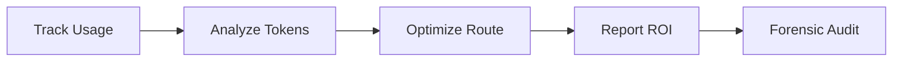

### 3. Token-Aware Routing & Model Selection Topology
Strategically routing requests to the most cost-effective model based on task complexity—sending simple summaries to "Flash" models while reserving high-tier "Frontier" models for complex reasoning.

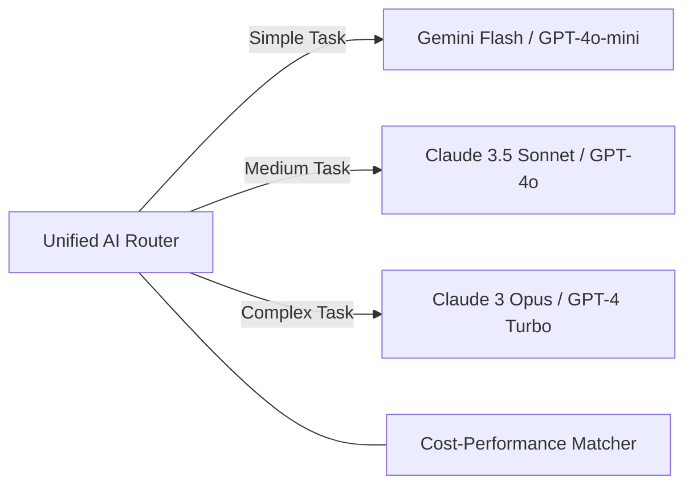

### 4. Semantic Caching & Prompt Reuse Flow
Avoiding redundant and expensive LLM calls by caching similar prompt embeddings, enabling the platform to return previously generated high-quality responses for near-zero token cost.

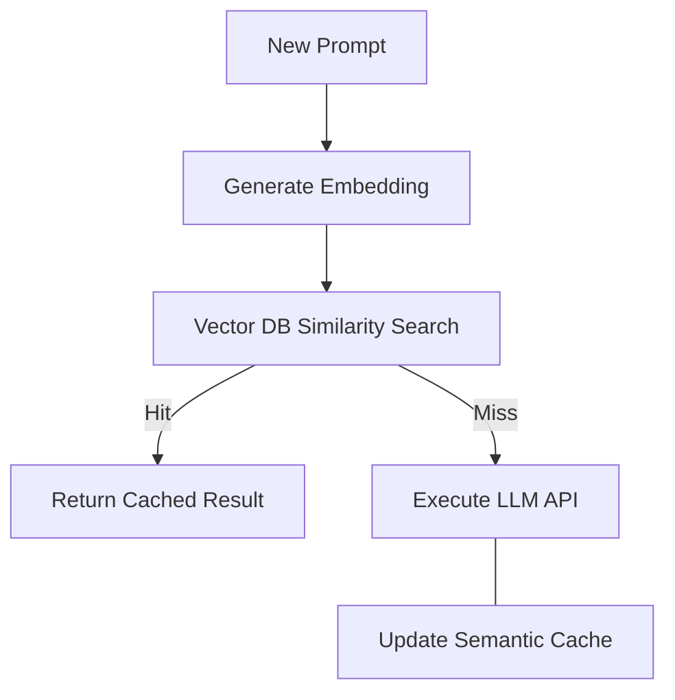

### 5. Multi-Model Batching & Throughput Optimization Flow
Grouping non-critical AI requests into batches to maximize GPU utilization and leverage lower-cost batch-processing tiers provided by major LLM providers.

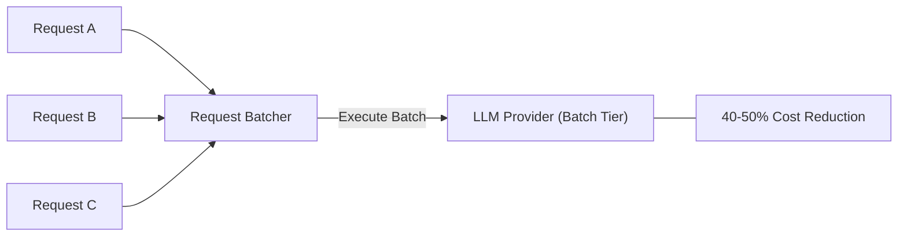

### 6. Prompt Engineering Cost-Efficiency Flow
Automatically shortening and compressing prompts by removing redundant context or filler words without losing semantic meaning, directly reducing the input token count.

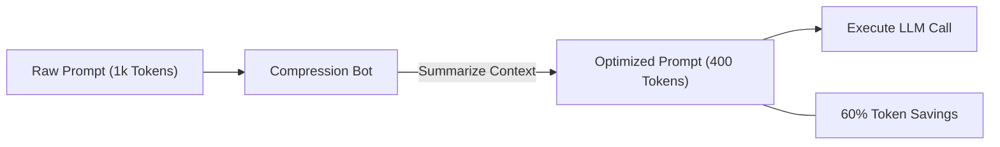

### 7. Institutional AI Frugality Scorecard
Grading organizational performance based on key indicators: Token Efficiency Ratio, Model Selection ROI, and Semantic Cache Hit Rate.

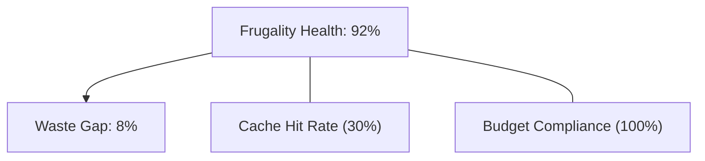

### 8. Identity & RBAC for AI Spend Governance
Managing fine-grained access to AI spend dashboards, routing policies, and prompt audit logs between AI Architects, FinOps Analysts, and Procurement Officers.

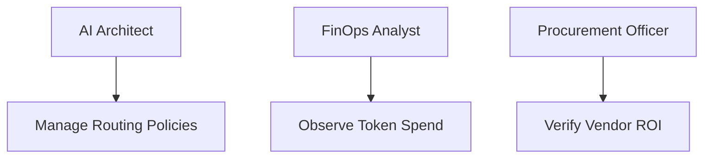

### 9. IaC Deployment: Optimizer-as-Code Framework
Using modular Terraform to deploy and manage the versioned distribution of the AI tracking hubs, routing workers, and forensic metadata lakes.

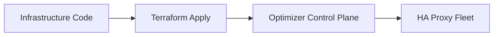

### 10. AIOps LLM Spend Anomaly & Volume Spike Validation Flow
Using advanced analytics to identify "Runaway Agents" or accidental infinite loops that could result in exponential token consumption and budget depletion.

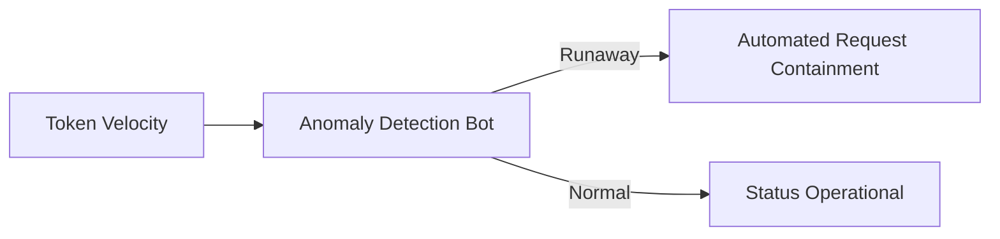

### 11. Metadata Lake for Forensic AI Audit
Storing long-term records of every prompt, every token count, and every cost assumption for institutional record-keeping, compliance auditing, and post-spend forensics.

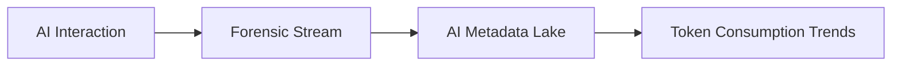

---

## 🏛️ Core AI FinOps Pillars

1.  **Unified AI Spend Control**: Maximizing ROI by centralizing all LLM interactions through a single institutional plane.
2.  **High-Efficiency Token Governance**: Eliminating waste through automated prompt compression and model-matching logic.
3.  **Semantic Caching Resiliency**: Minimizing costs by reusing high-quality responses for frequent institutional queries.
4.  **Zero-Waste Model Routing**: Protecting margins by ensuring every task is handled by the most cost-effective model.
5.  **Autonomous AI Spend Protection**: Identifying and containing rogue AI applications before they deplete organizational budgets.
6.  **Full AI Auditability**: Immutable recording of every prompt and token count for institutional forensics.

---

## 🛠️ Technical Stack & Implementation

### Optimizer Engine & APIs
*   **Framework**: Python 3.11+ / FastAPI.
*   **Routing Core**: Custom Python-based logic for task complexity scoring and model selection.
*   **Caching Hub**: Redis with Vector Extensions (e.g. RedisVL) for high-performance semantic search.
*   **Persistence**: PostgreSQL (Cost Ledger) and Redis (Usage Queue).
*   **Auth Orchestrator**: Federated OIDC/SAML for least-privilege AI spend access.

### FinOps Dashboard (UI)
*   **Framework**: React 18 / Vite.
*   **Theme**: Dark, Indigo, Slate (Modern high-fidelity AI aesthetic).
*   **Visualization**: D3.js for provider distribution maps and Recharts for token velocity analytics.

### Infrastructure & DevOps
*   **Runtime**: AWS EKS or Azure Kubernetes Service (AKS).
*   **Vector Plane**: Managed Vector DB (Pinecone/Milvus) for large-scale semantic caching.
*   **IaC**: Modular Terraform for deploying the optimizer landing zone and proxy fleet.

---

## 🏗️ IaC Mapping (Module Structure)

| Module | Purpose | Real Services |
| :--- | :--- | :--- |
| **`infrastructure/opt_hub`** | Central management plane | EKS, PostgreSQL, Redis |
| **`infrastructure/proxies`** | SDK & API gateway fleet | K8s Deployment, Python |
| **`infrastructure/cache`** | Semantic & Response cache | Redis, Vector DB |
| **`infrastructure/auditing`** | Forensic AI sinks | S3, Athena, Quicksight |

---

## 🚀 Deployment Guide

### Local Principal Environment
```bash
# Clone the optimizer platform
git clone https://github.com/devopstrio/llm-cost-optimizer.git
cd llm-cost-optimizer

# Configure environment
cp .env.example .env

# Launch the Optimizer stack
make init

# Trigger a mock AI request and semantic caching simulation
make simulate-optimization
```

Access the AI FinOps Hub at `http://localhost:3000`.

---

## 📜 License
Distributed under the MIT License. See `LICENSE` for more information.

---
<div align="center">
  <p>© 2026 Devopstrio. All rights reserved.</p>
</div>
