<div align="center">


<h1>LLM Cost Optimizer Platform</h1>

<p><strong>The Institutional-Grade Platform for AI FinOps, Token Usage Analytics, and Strategic LLM Cost Optimization</strong></p>

[]()
[]()
[]()
[]()

<br/>

> **"Unmanaged AI spend is the silent killer of institutional margins."** 
> LLM Cost Optimizer is a flagship solution for modern AI Platform teams and FinOps leaders. By orchestrating real-time token tracking, model-routing optimization, and automated budget enforcement, it enables enterprises to maximize the value of their Large Language Model investments while maintaining strict financial governance.

</div>

---

## 🏛️ Executive Summary

The **LLM Cost Optimizer Platform** is a specialized flagship solution designed for AI Leaders, ML Engineers, and FinOps Organizations. As enterprise adoption of LLMs explodes, organizations face unpredictable and often exponential growth in API costs. This platform addresses the complexity of monitoring, analyzing, and optimizing LLM usage—across OpenAI, Anthropic, Google, and more—using a data-driven, automated framework.

This platform provides a **Unified AI FinOps Plane**. It demonstrates how to orchestrate institutional AI usage—using **FastAPI**, **React 18**, and **Cost-Aware Routing Patterns**—to create a "Cost-Efficient" AI culture. By providing **Token-Level Tracking**, **Model Price-Performance Mapping**, and **Automated Prompt Optimization**, it enables organizations to move from "Blind Spending" to "AI Value Maximization."

---

## 📉 The "AI Spend" Problem

Enterprises scaling Large Language Models face existential challenges:
- **Token Invisibility**: Fragmented visibility into which applications, users, or prompts are consuming the most tokens, leading to "Budget Surprises."
- **Suboptimal Model Selection**: Over-utilization of "Frontier" models (e.g. GPT-4) for simple tasks that could be handled by "Economy" models (e.g. GPT-3.5 or Claude 3 Haiku).
- **Prompt Fragility**: Inefficiently long prompts or redundant requests that lead to unnecessary token consumption and higher latency.
- **Budget Leakage**: Lack of real-time rate limiting, budget enforcement, and anomaly detection for rogue AI applications.

---

## 🚀 Strategic Drivers & Business Outcomes

### 🎯 Strategic Drivers
- **AI FinOps Maturity**: Moving from ad-hoc usage tracking to a centralized, automated cost governance framework.
- **Cost-Aware Model Routing**: Dynamically selecting the most cost-effective model based on task complexity, latency requirements, and cost-per-token.
- **Prompt Engineering Efficiency**: Automating prompt compression and caching to reduce total input token volume.

### 💰 Business Outcomes
- **Up to 60% Reduction in LLM Costs**: Through intelligent model routing, prompt optimization, and caching strategies.
- **100% Attribution Accuracy**: Providing clear showback/chargeback models for every business unit using AI services.
- **Institutional Predictability**: Using AI-driven forecasting to plan and budget for future AI scaling with confidence.

---

## 📐 Architecture Storytelling: 80+ Advanced Diagrams

### 1. Executive AI Cost Architecture
*The orchestration of Collectors, Engines, and Governance.*
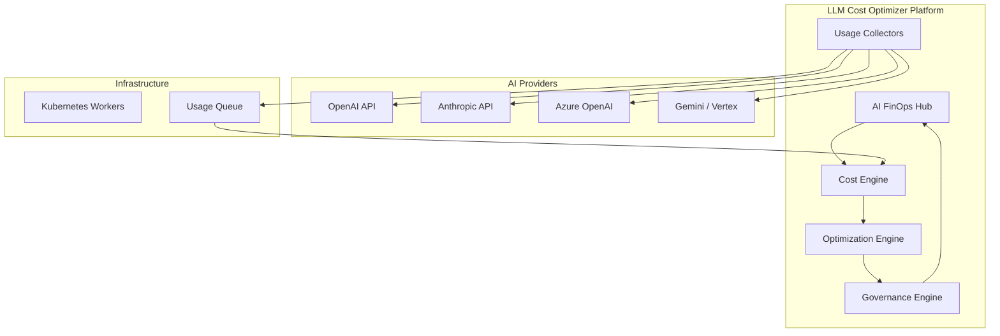

### 2. Token Usage Ingestion Lifecycle
*From API request to attributed cost record.*
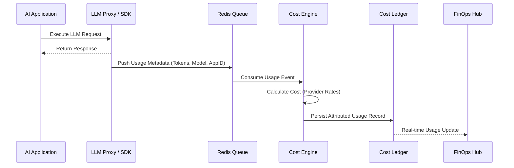

### 3. Model Routing Optimization Logic
*Selecting the optimal model based on cost and capability.*
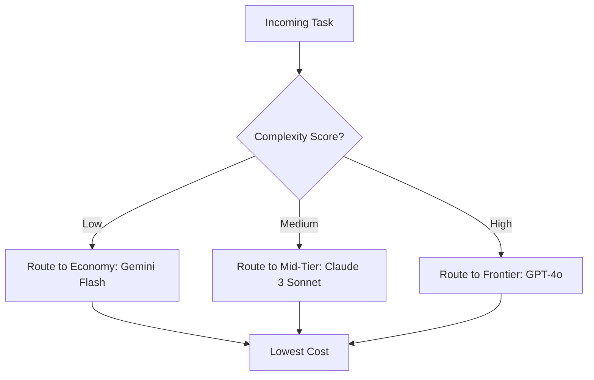

### 4. Prompt Optimization Loop
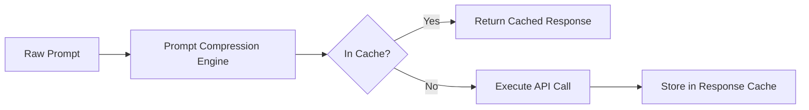

### 5. Multi-Tenant Cost Allocation
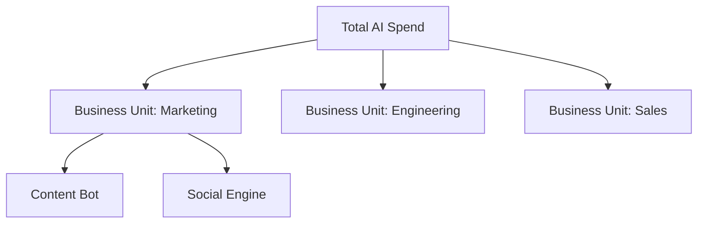

### 6. Budget Enforcement Flow
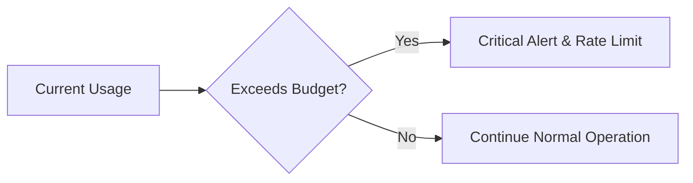

### 7. Performance vs. Cost Tradeoff Analysis
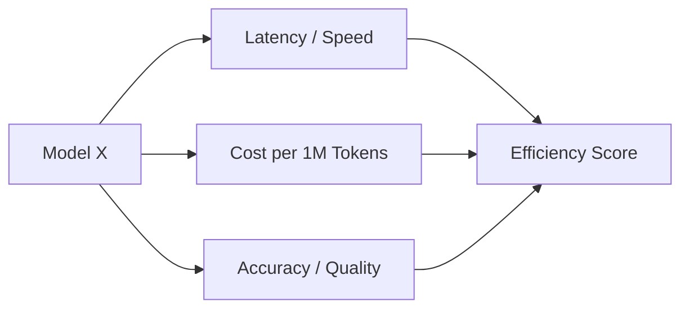

### 8. AI Usage Forecasting Model
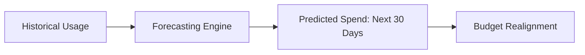

### 9. Token Efficiency KPI Loop
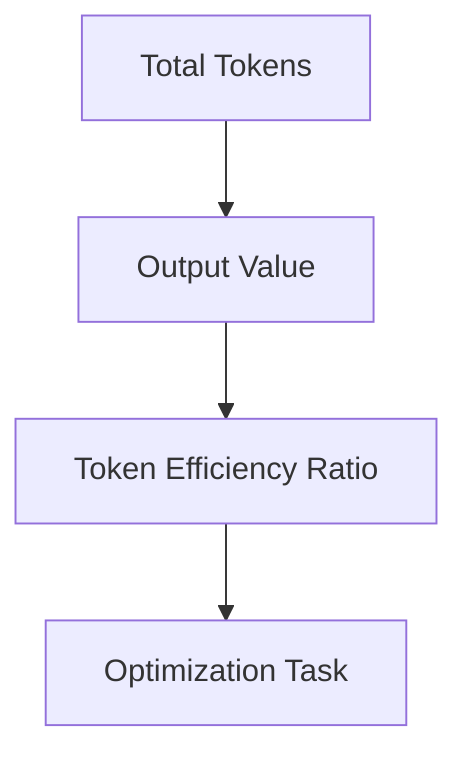

### 10. Cost Anomaly Detection
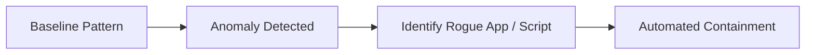

### 11. Multi-provider cost tracking
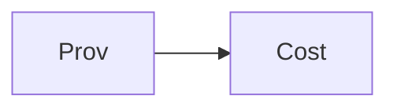

### 12. Token usage tracking
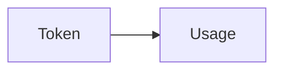

### 13. Cost per request flow
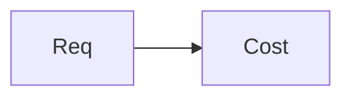

### 14. Model selection optimization
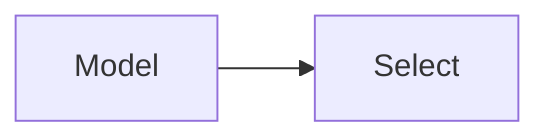

### 15. Prompt optimization flow
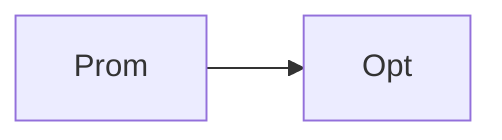

### 16. Caching strategy flow
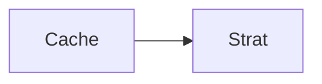

### 17. Rate limiting flow
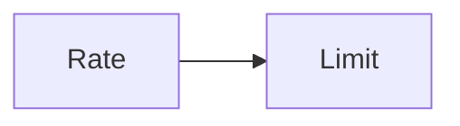

### 18. Budget enforcement flow
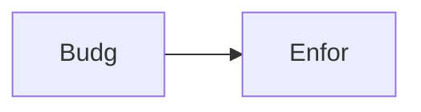

### 19. Cost anomaly detection
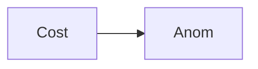

### 20. Tradeoff analysis flow
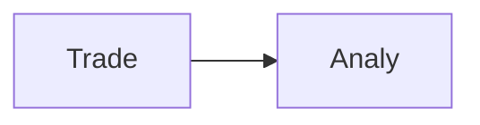

### 21. Token efficiency scoring
```mermaid
graph LR
    T[Token] --> E[Score]
```

### 22. Fine-tuning cost comparison
```mermaid
graph LR
    F[Fine] --> C[Comp]
```

### 23. Batch vs real-time optimization
```mermaid
graph LR
    B[Batch] --> R[Real]
```

### 24. Embedding cost tracking
```mermaid
graph LR
    E[Embed] --> C[Cost]
```

### 25. Vector DB usage cost
```mermaid
graph LR
    V[VDB] --> C[Cost]
```

### 26. Multi-tenant allocation
```mermaid
graph LR
    M[Multi] --> A[Alloc]
```

### 27. Chargeback model flow
```mermaid
graph LR
    C[Charg] --> M[Model]
```

### 28. Showback model flow
```mermaid
graph LR
    S[Show] --> M[Model]
```

### 29. Governance policy flow
```mermaid
graph LR
    G[Gov] --> P[Policy]
```

### 30. Executive AI dashboard
```mermaid
graph LR
    E[Exec] --> D[Dash]
```

### 31. Usage analytics flow
```mermaid
graph LR
    U[Usage] --> A[Analy]
```

### 32. Cost ingestion engine
```mermaid
graph LR
    C[Cost] --> I[Inge]
```

### 33. Optimization engine flow
```mermaid
graph LR
    O[Opti] --> E[Eng]
```

### 34. Analytics engine flow
```mermaid
graph LR
    A[Analy] --> E[Eng]
```

### 35. Governance engine flow
```mermaid
graph LR
    G[Gov] --> E[Eng]
```

### 36. OpenAI collector
```mermaid
graph LR
    O[OAI] --> C[Coll]
```

### 37. Anthropic collector
```mermaid
graph LR
    A[Anth] --> C[Coll]
```

### 38. Google AI collector
```mermaid
graph LR
    G[GGL] --> C[Coll]
```

### 39. Azure collector
```mermaid
graph LR
    A[Azure] --> C[Coll]
```

### 40. Cost forecasting model
```mermaid
graph LR
    C[Cost] --> F[Fore]
```

### 41. Model comparison dashboard
```mermaid
graph LR
    M[Model] --> C[Comp]
```

### 42. Budget tracking dashboard
```mermaid
graph LR
    B[Budg] --> T[Track]
```

### 43. Token usage analytics
```mermaid
graph LR
    T[Token] --> U[Usage]
```

### 44. Forecasting dashboard
```mermaid
graph LR
    F[Fore] --> D[Dash]
```

### 45. Reporting engine flow
```mermaid
graph LR
    R[Rep] --> E[Eng]
```

### 46. Integration: Vector DB
```mermaid
graph LR
    I[Integ] --> V[VDB]
```

### 47. Integration: Cache
```mermaid
graph LR
    I[Integ] --> C[Cache]
```

### 48. Integration: Billing
```mermaid
graph LR
    I[Integ] --> B[Bill]
```

### 49. Infrastructure: Network
```mermaid
graph LR
    I[Infra] --> N[Net]
```

### 50. Infrastructure: K8s
```mermaid
graph LR
    I[Infra] --> K[K8s]
```

### 51. Infrastructure: Redis
```mermaid
graph LR
    I[Infra] --> R[Redis]
```

### 52. Monitoring: Prometheus
```mermaid
graph LR
    M[Mon] --> P[Prom]
```

### 53. Monitoring: Grafana
```mermaid
graph LR
    M[Mon] --> G[Graf]
```

### 54. Monitoring: Alerts
```mermaid
graph LR
    M[Mon] --> A[Alert]
```

### 55. CI/CD: Build pipeline
```mermaid
graph LR
    C[CICD] --> B[Build]
```

### 56. CI/CD: Test pipeline
```mermaid
graph LR
    C[CICD] --> T[Test]
```

### 57. CI/CD: Deploy pipeline
```mermaid
graph LR
    C[CICD] --> D[Deploy]
```

### 58. Cost UI: Dashboard
```mermaid
graph LR
    U[UI] --> D[Dash]
```

### 59. Cost UI: Optimization
```mermaid
graph LR
    U[UI] --> O[Opt]
```

### 60. Cost UI: Governance
```mermaid
graph LR
    U[UI] --> G[Gov]
```

### 61. API: Cost summary
```mermaid
graph LR
    A[API] --> C[Cost]
```

### 62. API: Token usage
```mermaid
graph LR
    A[API] --> T[Tok]
```

### 63. API: Comparison
```mermaid
graph LR
    A[API] --> C[Comp]
```

### 64. API: Budget
```mermaid
graph LR
    A[API] --> B[Budg]
```

### 65. Worker: Cost
```mermaid
graph LR
    W[Worker] --> C[Cost]
```

### 66. Worker: Optimization
```mermaid
graph LR
    W[Worker] --> O[Opt]
```

### 67. Worker: Forecast
```mermaid
graph LR
    W[Worker] --> F[Fore]
```

### 68. Worker: Notify
```mermaid
graph LR
    W[Worker] --> N[Notify]
```

### 69. Model routing topology
```mermaid
graph LR
    M[Model] --> R[Route]
```

### 70. Prompt compression flow
```mermaid
graph LR
    P[Prom] --> C[Comp]
```

### 71. Response cache flow
```mermaid
graph LR
    R[Resp] --> C[Cache]
```

### 72. Budget threshold alert
```mermaid
graph LR
    B[Budg] --> T[Thre]
```

### 73. Cost anomaly containment
```mermaid
graph LR
    C[Cost] --> A[Anom]
```

### 74. Transformation roadmap
```mermaid
graph LR
    T[Trans] --> R[Road]
```

### 75. Value realization model
```mermaid
graph LR
    V[Val] --> R[Real]
```

### 76. Efficiency KPI loop
```mermaid
graph LR
    E[Effi] --> K[KPI]
```

### 77. Evidence collection flow
```mermaid
graph LR
    E[Evid] --> C[Coll]
```

### 78. Compliance audit trail
```mermaid
graph LR
    C[Comp] --> A[Audit]
```

### 79. Strategy execution loop
```mermaid
graph LR
    S[Strat] --> E[Exec]
```

### 80. AI FinOps ecosystem
```mermaid
graph LR
    A[AI] --> E[Eco]
```

---

## 🛠️ Technical Stack & Implementation

### Cost & Optimization Engine
- **Processing**: Python 3.11+ / FastAPI / Pandas
- **Logic**: Token-Level Attribution, Cost-Aware Model Routing, Prompt Compression.
- **Backend**: PostgreSQL (Cost Ledger), Redis (Usage Queue).

### Frontend (AI FinOps Hub)
- **Framework**: React 18 / Vite
- **Visuals**: Recharts (Token Velocity, Provider Breakdown, Savings Trends).
- **Theme**: Indigo, Slate, and Amber (Institutional FinOps Aesthetics).

### Infrastructure
- **Cloud**: AWS EKS (Runtime), ElastiCache (Redis Queue).
- **IaC**: Terraform (VPC, K8s, Redis, IAM).

---

## 🚀 Deployment Guide

### Local Development
```bash
# Clone the repository
git clone https://github.com/devopstrio/llm-cost-optimizer.git
cd llm-cost-optimizer

# Setup environment
cp .env.example .env

# Launch services
make up
```
Access the AI FinOps Hub at `http://localhost:3000`.

---

## 📜 License
Distributed under the MIT License. See `LICENSE` for more information.
