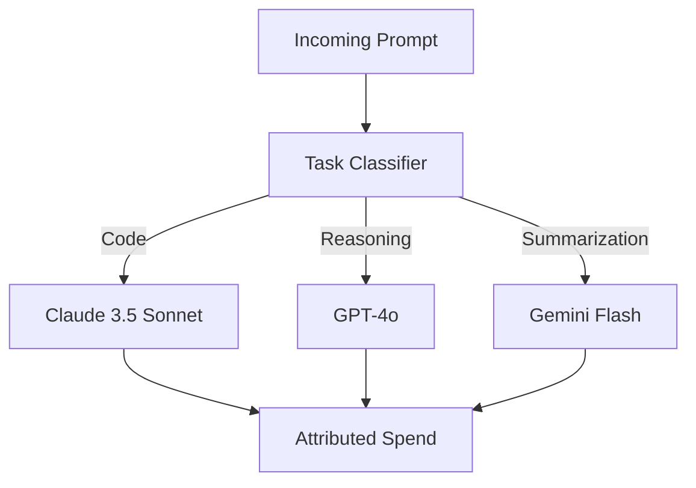
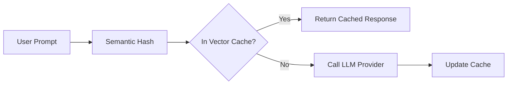
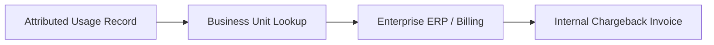

# Optimization & AI Governance Diagrams

## 31. Cost-Aware Model Router (Dynamic)

```mermaid
graph TD
    Prompt[Incoming Prompt] --> Classify[Task Classifier]
    Classify -->|Code| Sonnet[Claude 3.5 Sonnet]
    Classify -->|Reasoning| GPT4o[GPT-4o]
    Classify -->|Summarization| Flash[Gemini Flash]
    Sonnet --> Cost[Attributed Spend]
    GPT4o --> Cost
    Flash --> Cost
```

## 34. Response Caching Logic

```mermaid
graph LR
    P[User Prompt] --> Hash[Semantic Hash]
    Hash --> Cache{In Vector Cache?}
    Cache -->|Yes| Hit[Return Cached Response]
    Cache -->|No| Execute[Call LLM Provider]
    Execute --> Update[Update Cache]
```

## 40. "Chargeback" Billing Flow

```mermaid
graph LR
    Record[Attributed Usage Record] --> BU[Business Unit Lookup]
    BU --> Ledger[Enterprise ERP / Billing]
    Ledger --> Invoice[Internal Chargeback Invoice]
```
