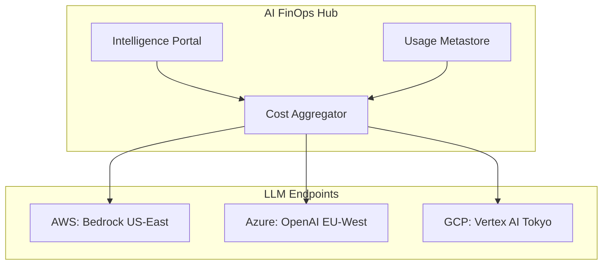
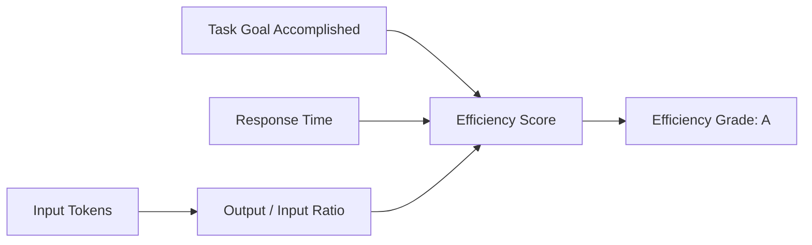
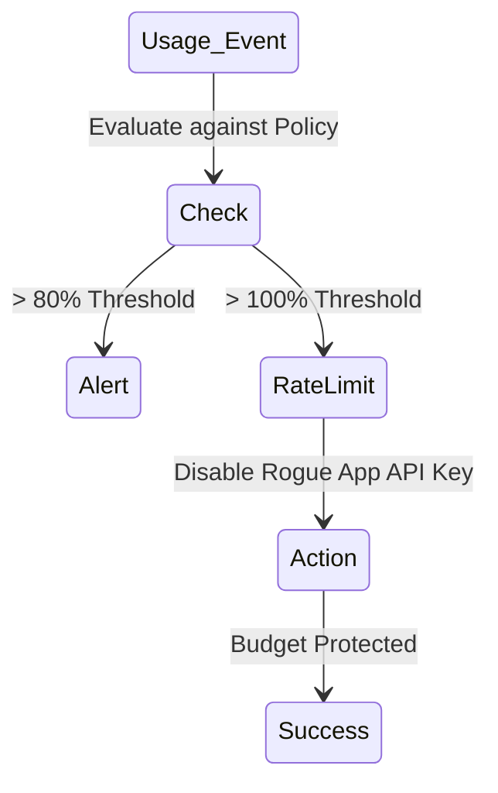

# Architecture & FinOps Diagrams

## 11. Multi-Provider Usage Topology (Detailed)
*How the platform orchestrates usage tracking across global AI endpoints.*

## 13. "Token Efficiency" Scoring Logic

## 20. Budget Enforcement Pipeline

